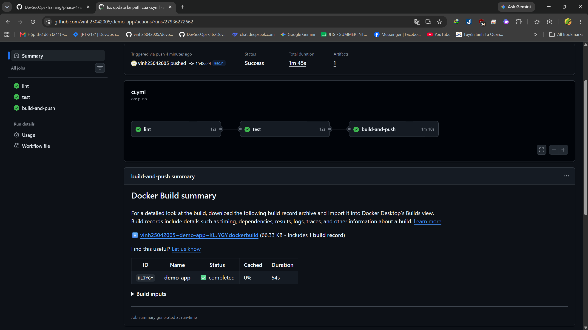
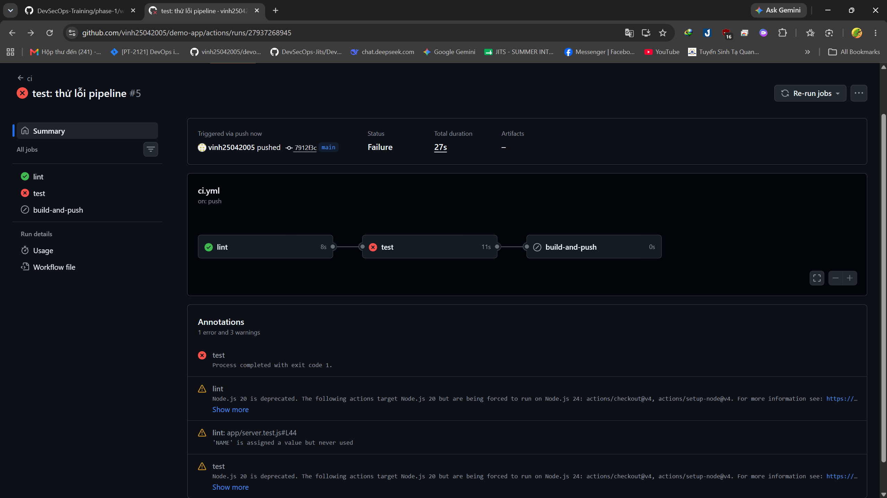
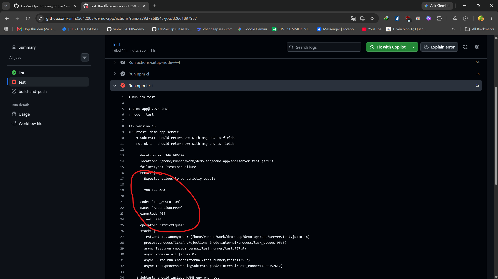
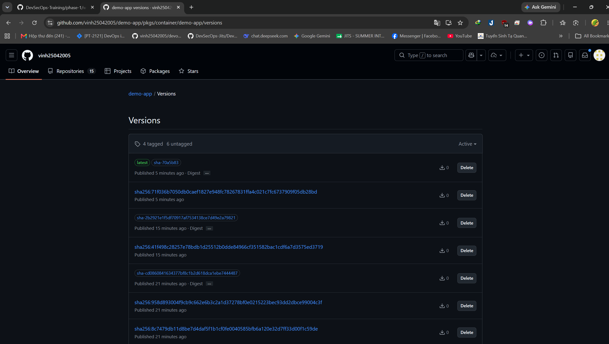
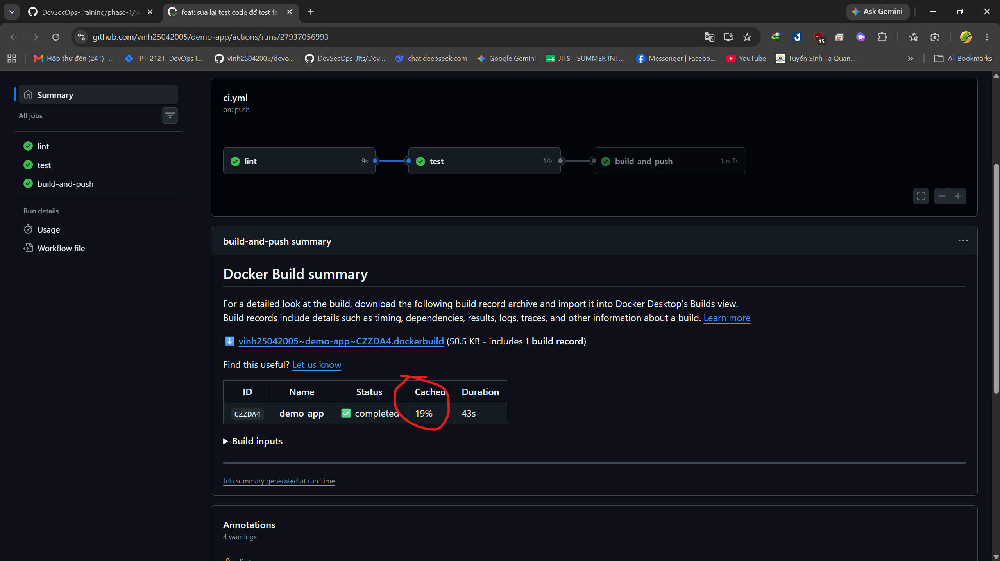
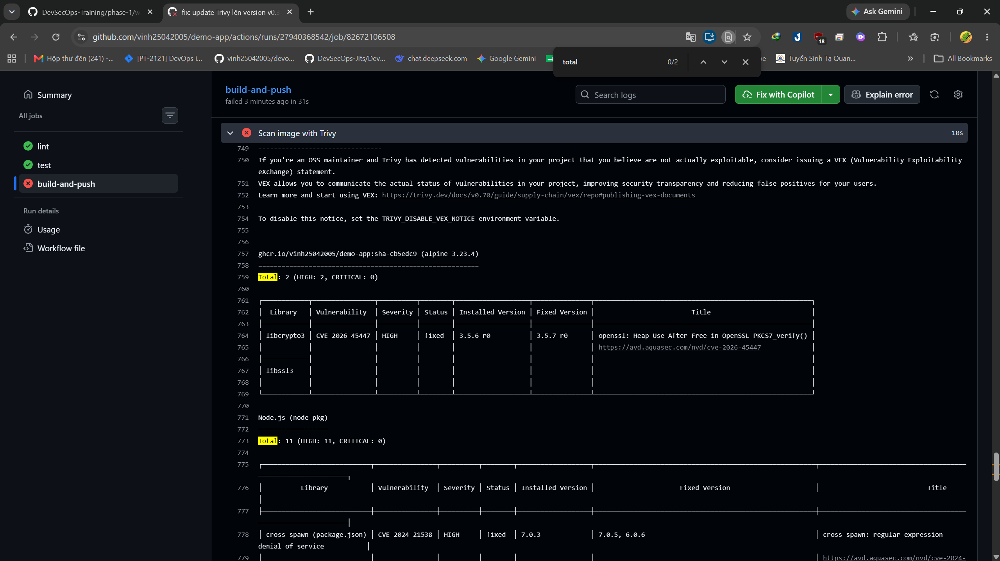

## Task: `Day 6 (W2-D1) — CI/CD Basics`

- **Intern**: `Nguyễn Quang Vinh`
- **Phase / Week / Day**: `Phase 1 / Week 2 / Day 1`
- **Branch**: `phase-1/week-2/day-1-cicd-basics`
- **Submitted at**: `2026-06-22 16:00` (timezone +07)
- **Time spent**: `<5h>`

## 1. Mục tiêu
- Xây dựng CI/CD pipeline cho `demo-app`  gồm 4 stage: lint → test → build Docker image → push lên GHCR.
- Áp dụng CI: tự động lint + test khi push code. Áp dụng CD: tự động build và push image khi merge vào `main`.

## 2. Cách chạy

### 2.1. Setup local

```bash
# 1. Clone repo
git clone https://github.com/vinh25042005/demo-app.git
cd demo-app

# 2. Cài dependencies
cd app
npm install
cd ..

# 3. Chạy lint
cd app && npm run lint

# 4. Chạy test
cd app && npm test
```
### 2.2. Pipeline
Pipeline tự động chạy khi push lên GitHub

- **Push / PR vào `main`** → chạy lint + test.
- **Push vào `main`** → chạy thêm build-and-push image lên GHCR.

Link repo: [https://github.com/vinh25042005/demo-app/tree/day6-cicd](https://github.com/vinh25042005/demo-app/tree/day6-cicd)

## 3. Kết quả

### Pipeline thành công (Run #9)


3 job xanh: lint ✅ → test ✅ → build-and-push ✅
- Link: [https://github.com/vinh25042005/demo-app/actions/runs/27937802416](https://github.com/vinh25042005/demo-app/actions/runs/27937802416)

### Pipeline thất bại do test fail (Run #5)


Test cố tình assert sai status code (200 → 404) để chứng minh CI bắt được lỗi.
- Chi tiết: 
- Link: [https://github.com/vinh25042005/demo-app/actions/runs/27937268945](https://github.com/vinh25042005/demo-app/actions/runs/27937268945)

### Image trên GHCR


- Link package: [https://github.com/vinh25042005/demo-app/pkgs/container/demo-app](https://github.com/vinh25042005/demo-app/pkgs/container/demo-app)
- Tag hiện tại: `sha-70a5b83` và `latest`

### Cache hoạt động


Job `test` dùng lại `node_modules` từ job `lint` nhờ `actions/cache` — giảm thời gian cài đặt.

### Trivy scan — Phát hiện CVE (HIGH/CRITICAL)


Trivy quét image `demo-app`, phát hiện **13 HIGH** CVE (libcrypto3 + Node.js packages).
Pipeline fail vì `exit-code: 1` khi có HIGH/CRITICAL.

- Link: https://github.com/vinh25042005/demo-app/actions/runs/<run-id>

## 4. Khó khăn & cách giải quyết
1. **WSL dùng nhầm npm Windows** → eslint lỗi UNC path, không tìm được file config.
   → Fix: Cài Node.js riêng trong WSL (`/usr/bin/node`), ưu tiên PATH Linux.

2. **Test fallback "docker" fail** vì process con kế thừa biến `NAME` từ terminal host.
   → Fix: Dùng destructuring `const { NAME, ...cleanEnv } = process.env` để xóa `NAME` trước khi fork.

3. **eslint: Permission denied** — file `node_modules/.bin/eslint` thiếu quyền thực thi do lỗi umask khi copy workspace.
   → Fix: `chmod +x node_modules/.bin/eslint` (hoặc `rm -rf node_modules && npm install`).

4. **Test treo process khi assert fail** — `child.kill()` không chạy được vì đặt sau `assert`, dẫn đến process con treo, pipeline treo.
   → Fix: Bọc `try/finally` quanh toàn bộ logic test, đặt `child.kill()` trong `finally` để luôn cleanup dù test pass hay fail.

## 5. Self-check
- [x] Code chạy được trên máy sạch.
- [x] README có hướng dẫn run lại.
- [x] Không hard-code secret.
- [x] Commit message theo Conventional Commits.
- [x] Đã review lại code 1 lượt.