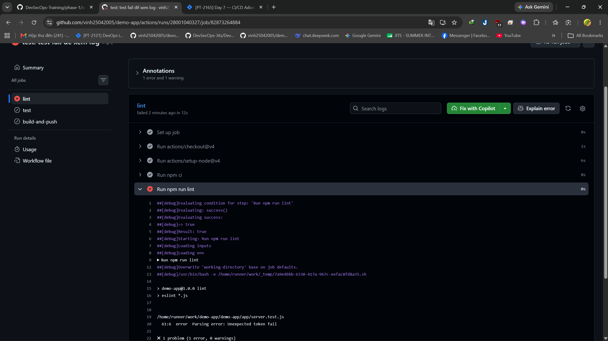

# Part E 

## 1. Khi pipeline thất bại ở step `push`, làm sao retry nhanh không build lại?

**Dùng `docker save` + artifact — build 1 lần, push riêng, retry push không cần build lại.**

```bash
# Job 1: Build + save + upload artifact
build-job:
  runs-on: ubuntu-latest
  steps:
    - uses: actions/checkout@v4
    - run: docker build -t ghcr.io/${{ github.repository_owner }}/demo-app:sha-${{ github.sha }} .
    - run: docker save -o /tmp/image.tar ghcr.io/${{ github.repository_owner }}/demo-app:sha-${{ github.sha }}
    - uses: actions/upload-artifact@v4
      with:
        name: docker-image
        path: /tmp/image.tar

# Job 2: Download artifact + push (chỉ retry job này nếu fail)
push-job:
  needs: build-job
  runs-on: ubuntu-latest
  steps:
    - uses: actions/download-artifact@v4
      with:
        name: docker-image
    - run: docker load -i image.tar
    - run: docker push ghcr.io/${{ github.repository_owner }}/demo-app:sha-${{ github.sha }}
```

→ Nếu `push` fail, retry `push-job` → chỉ load + push, không build lại.

## 2. Cách debug 1 job mà chỉ fail trên runner (không tái hiện local)?

Nguyên nhân: Runner khác môi trường local

**Giải pháp: Bật debug log (`ACTIONS_STEP_DEBUG`).**

**Cách làm:**

Vào GitHub repo → Settings → Secrets and variables → Actions → New repository secret:

- name: `ACTIONS_STEP_DEBUG` 
- secret: true

Sau đó chạy lại workflow → log in ra chi tiết từng step: command được chạy, output, biến môi trường, thời gian thực thi.
