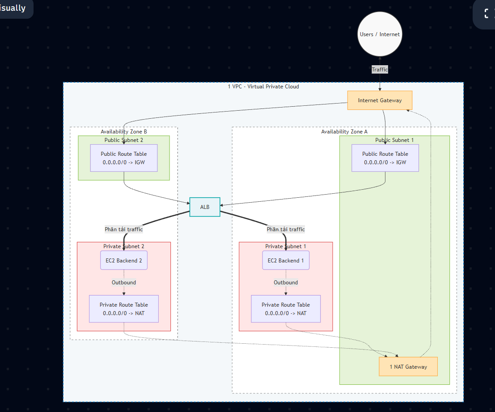

# Part A: IAM

## 1. Phân biệt: user, group, role, policy

### Iam user
- Có username/password hoặc access key riêng
- User có policy phù hợp với task của người đó

### IAM group
- là nhóm các Iam user
- Các user thuộc group sẽ có policy của group
- Một user có thể thuộc nhiều group

### IAM role
- role cũng có các quyền cụ thể giống User nhưng user thì là một người duy nhất, còn role có thể gắn cho bất kỳ fai

### IAM policy
- Quy định xem ai được làm gì, với điều kiện gì....., giống kiểu một bộ luật

## 2. Trust policy vs identity policy vs resource policy?

### Trust policy 
- chỉ dùng cho IAM role, cho biết ai có thể được cấp role đó

### Identity policy
- Là policy trực tiếp của user, group hoặc role, cho biết là người được gắn có thể được làm gì

### Resource Policy
- Là policy gắn vào tài nguyên AWS như s3,... cho biết ai được truy cập tài nguyên đó

## 3. Tại sao IAM role tốt hơn IAM user key cho EC2/CI/CD?
- IAM user key là tĩnh => dễ lộ, ai có key là vào được => khó phát hiện được ai dùng cái key bị lộ đó
- IAM Role thì cho biết ai mới có quyền nên bảo mật tốt hơn, chỉ người nào được cấp role mới dùng được 

## 4. Giải thích policy

```json
{
  "Version": "2012-10-17",
  "Statement": [{
    "Effect": "Allow",
    "Action": ["s3:GetObject"],
    "Resource": "arn:aws:s3:::my-bucket/*",
    "Condition": { "IpAddress": { "aws:SourceIp": "203.0.113.0/24" } }
  }]
}
```

- Version: Phiên bản cú pháp policy
- Effect: Allow hoặc Deny 1 hành động nào đó
- Action: Là hành động được allow hoặc deny, ở đây là tải file từ s3
- Resource: Tài nguyên cho phép dùng action - file trong bucket `my-bucket`
- Condition: Điều kiện để kích hoạt statement đó, nếu sai thì vô hiệu statement - ip phải thuộc `203.0.113.0/24`

## 5. Khi 1 user nằm trong group có Allow, và policy gắn trực tiếp user có Deny — kết quả?
- kết quả luôn là deny, nếu trong 100 group có allow mà chỉ 1 cái deny cũng bị chặn


# Part E VPC topology

- Tại sao private: Không ai cần gọi trực tiếp EC2. Mọi request qua ALB. EC2 private => không public IP =>  bảo mật hơn
- Ra interneet qua NAT GW